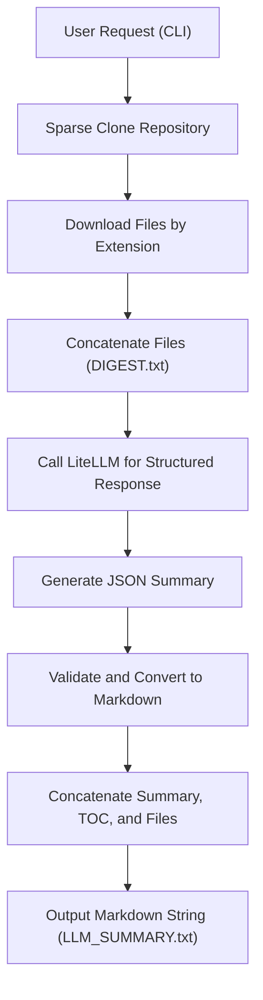

# GitGit: Repo Sparse Clone & LLM Summarizer 🚀

## Overview 📋

GitGit is a powerful CLI tool designed for **sparse cloning** of GitHub repositories, targeting specific file extensions (e.g., `.md`, `.rst`, `.py`). It concatenates and summarizes documentation and code files, optionally generating a **structured, LLM-powered summary** using advanced models via [LiteLLM](https://github.com/BerriAI/litellm). This tool is ideal for technical documentation audits, repository analysis, and preparing LLM-ready prompts.

---

## Purpose 🎯

GitGit was created to address limitations in tools like **gitingest**, which often miss critical documentation files (e.g., `.rst`) and lack sparse cloning capabilities. It provides:
- **Selective cloning** of documentation and code files.
- **Comprehensive summarization** of repository contents.
- **Structured LLM summaries** optimized for technical users and downstream AI tasks.

---

## Features ✨

- **Sparse Cloning**: Downloads only files with specified extensions, reducing bandwidth and time.
- **Content Summarization**: Aggregates and summarizes files, including stats and directory trees.
- **LLM-Powered Summaries**: Generates structured JSON summaries (converted to Markdown) using models like Gemini or GPT-4o.
- **Flexible CLI**: Customize repository, file extensions, LLM model, and output format.
- **Robust Caching**: Utilizes Redis or in-memory caching for efficient LLM calls (see `initialize_litellm_cache.py`).
- **JSON Handling**: Validates and repairs JSON outputs for reliability (see `json_utils.py`).
- **Log Safety**: Truncates large data (e.g., base64 images) for safe logging (see `log_utils.py`).

---

## Installation 🛠️

1. Clone the repository or install dependencies:
   ```bash
   pip install -r requirements.txt
   ```
2. Alternatively, install individual dependencies:
   ```bash
   pip install typer litellm markitdown pydantic tiktoken loguru tenacity python-dotenv json-repair
   ```
3. Set up environment variables (e.g., for Redis or LLM APIs) in a `.env` file.

---

## Usage 📖

Run GitGit via the CLI to analyze a repository:

### Command Syntax
```bash
python gitgit.py analyze REPO_URL [OPTIONS]
```

#### Arguments
- `REPO_URL`: GitHub repository URL (e.g., `https://github.com/arangodb/python-arango`).

#### Options
| Option            | Description                                                                 | Example                     |
|-------------------|-----------------------------------------------------------------------------|-----------------------------|
| `--exts`, `-e`    | Comma-separated file extensions to include (default: `md,rst`)              | `--exts md,rst,py`          |
| `--summary`       | Generate an LLM-based summary of the repository                             | `--summary`                 |
| `--llm-model`     | LLM model for summarization (default: `gemini-2.5-pro-preview-03-25`)       | `--llm-model gpt-4o`        |
| `--debug`         | Use hardcoded debug parameters for testing                                 | `--debug`                   |

### Examples
1. **Clone and summarize documentation files**:
   ```bash
   python gitgit.py analyze https://github.com/arangodb/python-arango --exts md,rst
   ```
   - Clones `.md` and `.rst` files, generates `SUMMARY.txt`, `DIGEST.txt`, and `TREE.txt`.

2. **Generate an LLM-powered summary**:
   ```bash
   python gitgit.py analyze https://github.com/arangodb/python-arango --exts md,rst,py --summary --llm-model gpt-4o
   ```
   - Clones `.md`, `.rst`, and `.py` files, generates all output files, including `LLM_SUMMARY.txt`.

3. **Debug mode for development**:
   ```bash
   python gitgit.py analyze --debug --summary
   ```
   - Uses hardcoded parameters (e.g., `arangodb/python-arango`, `.md,.rst`) for testing.

---

## Output Files 📂

Output files are saved in `repos/<repo_name>_sparse/`:
- **SUMMARY.txt**: Statistics (file count, bytes, estimated tokens) and list of included files.
- **DIGEST.txt**: Concatenated contents of all selected files, separated by headers.
- **TREE.txt**: Directory tree of the cloned files.
- **LLM_SUMMARY.txt**: Structured Markdown summary (if `--summary` is used), derived from LLM-generated JSON.

---

## Workflow 🔄

The following Mermaid chart illustrates the GitGit workflow, from user request to the final Markdown output for LLM ingestion:



---

## LLM Summary Process 🤖

The LLM summarization (`llm_summarize` in `gitgit.py`):
1. Reads `DIGEST.txt` and prompts the LLM to generate a JSON object with:
   - `summary`: A concise technical overview of the repository.
   - `table_of_contents`: Ordered list of files or sections.
   - `key_sections`: (Optional) Important files/sections with brief descriptions.
2. Validates the JSON output using Pydantic (`RepoSummary` model).
3. Converts the JSON to Markdown using `json_to_markdown` (from `json_utils.py`).
4. Saves the result as `LLM_SUMMARY.txt` in Markdown or JSON format.

---

## Comparison with gitingest ⚖️

Unlike **gitingest**, GitGit:
- Supports **sparse cloning** by file extension, ensuring no critical files (e.g., `.rst`) are missed.
- Provides **detailed summarization** with file stats and directory trees.
- Generates **LLM-optimized summaries** for technical documentation and AI workflows.
- Offers **customizable CLI options** for tailored analysis.

---

## Customization 🧰

- **Add File Extensions**: Use `--exts` to include additional formats (e.g., `--exts md,rst,py,txt`).
- **Change LLM Models**: Specify any LiteLLM-supported model with `--llm-model`.
- **Modify Markdown Output**: Edit `json_to_markdown` in `json_utils.py` to customize summary formatting.
- **Adjust Caching**: Configure Redis settings in `.env` or modify `initialize_litellm_cache.py`.

---

## Troubleshooting 🛡️

- **Missing Dependencies**: Run `pip install -r requirements.txt` to install all required packages.
- **API Credentials**: Ensure GitHub and LLM API keys are set in `.env` (e.g., `REDIS_HOST`, `GOOGLE_VERTEX_PROJECT`).
- **Redis Connection Issues**: If Redis fails, GitGit falls back to in-memory caching (see `initialize_litellm_cache.py`).
- **JSON Errors**: Invalid JSON is automatically repaired using `json_utils.py`.

---

## License 📜

MIT License

---

## Acknowledgments 🙌

- [LiteLLM](https://github.com/BerriAI/litellm) for LLM integration.
- [MarkItDown](https://github.com/microsoft/markitdown) for Markdown conversion.
- [Typer](https://github.com/tiangolo/typer) for CLI functionality.
- [json-repair](https://github.com/josdejong/jsonrepair) for JSON validation.

---

## Contributing 🤝

Questions or suggestions? Open an issue or submit a pull request on GitHub!